<div align="center">


# Narbulut Takvim

**Narbulut panelinin takvim modülü — sıfırdan yeniden tasarımı.**
Kullanıcı araştırmasından ürün spec'lerine, tasarım dilinden çalışan prototipe kadar
tüm faz çıktıları bu depoda.

<br>


-B45309)

</div>

<br>

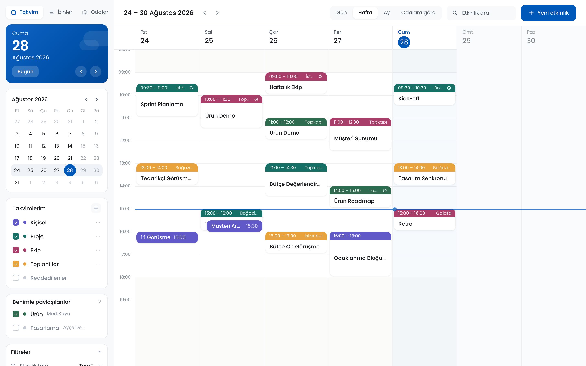

---

## İçindekiler

- [Bu depoda ne var](#bu-depoda-ne-var)
- [Hızlı başlangıç](#hızlı-başlangıç)
- [Ekranlar](#ekranlar)
- [Depo yapısı](#depo-yapısı)
- [Faz durumu](#faz-durumu)
- [Dokümantasyon](#dokümantasyon)
- [Ne var, ne yok](#ne-var-ne-yok)
- [Kalite kapıları](#kalite-kapıları)
- [Tasarım dili](#tasarım-dili)
- [Lisans](#lisans)

---

## Bu depoda ne var

Mevcut Narbulut Takvim modülünün denetlenmesiyle başlayan, kanıta dayalı bir yeniden
tasarım çalışmasının **tüm zinciri**:

**Audit → Benchmark → Problem kümeleri → Ürün kararları → Spec'ler → Tasarım dili → Çalışan prototip**

Zincirin her halkası izlenebilir: prototipteki her davranışın arkasında numaralı bir iş
kuralı (`BR-*`), her iş kuralının arkasında bir spec, her spec'in arkasında `DECISIONS.md`'de
gerekçelendirilmiş bir karar var.

> **Prototip gerçek bir uygulamadır, tıklanabilir maket değildir.** Durum gerçekten değişir,
> iş kuralları gerçekten uygulanır. Backend yoktur — veri bellekte tutulur.

---

## Hızlı başlangıç

Node 20+ gerekir (geliştirmede Node 24.18 kullanıldı).

```bash
git clone git@github.com:EflaNe/narbulut-takvim-prototype.git
cd narbulut-takvim-prototype/prototype
npm install
npm run dev
```

→ **http://localhost:5180**

> `npm install` **tek internet gerektiren adımdır.** Sonrasında prototip tamamen çevrimdışı
> çalışır: Poppins fontu paketin içindedir (`src/styles/fonts/`), harici CDN veya ağ
> isteği yoktur. Sunum ortamında internet olmaması sorun değildir.

Diğer komutlar — hepsi `prototype/` içinden:

| Komut | Ne yapar |
|---|---|
| `npm run dev` | Geliştirme sunucusu (sunum için bu yeterli) |
| `npm run build` | `dist/` üretir (`tsc -b` + `vite build`) |
| `npm run preview` | Üretilen `dist/`'i sunar |
| `npm test` | 42 birim/entegrasyon testi (vitest) |
| `npm run typecheck` | TypeScript kontrolü |
| `npm run lint` | oxlint |
| `node emails/build.mjs` | 16 e-posta şablonunu yeniden üretir |
| `node scripts/demo-flow.mjs` | 24 adımlık canonical demo akışını uçtan uca yürütür |
| `node scripts/screenshots.mjs` | Bu README'deki ekran görüntülerini üretir |

> Son üç betik `puppeteer-core` ile **sistemdeki Google Chrome'u** kullanır, ayrıca tarayıcı
> indirmez. CI ortamında Chrome bulunmadığı için çalışmazlar — CI yalnızca build, test ve
> lint yürütür.

---

## Ekranlar

Aşağıdaki görseller `node scripts/screenshots.mjs` ile prototipin kendisinden üretilmiştir.

### Etkinlik ve oda

| Etkinlik detayı | Oda seçici |
|---|---|
| 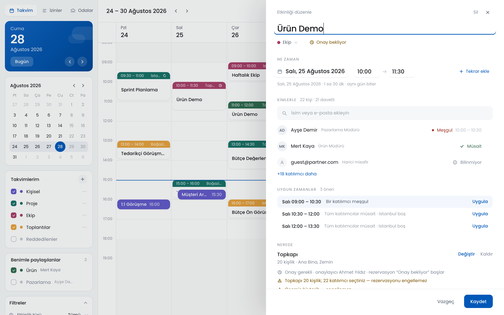 | 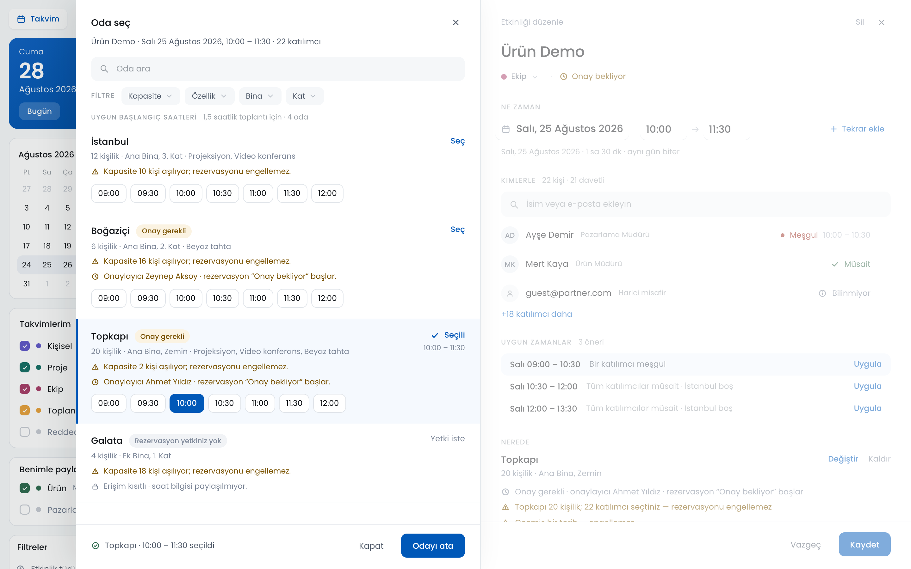 |
| Katılımcılar, oda, tekrar ve rezervasyon durumu tek yerde. | Müsait / dolu / onay bekliyor / yetkisiz durumları gerçek kurallarla ayrışır. |

| Hızlı oluşturma | Odalara göre görünüm |
|---|---|
| 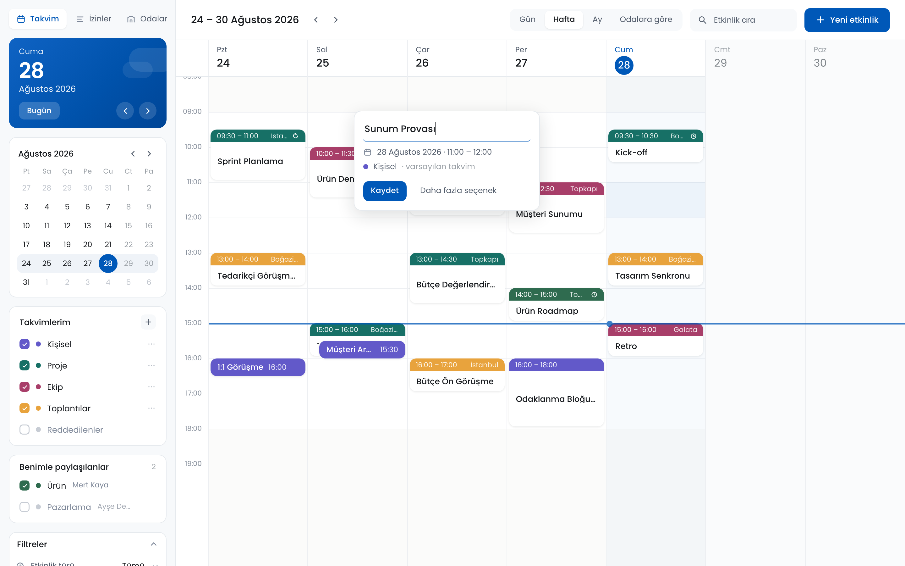 | 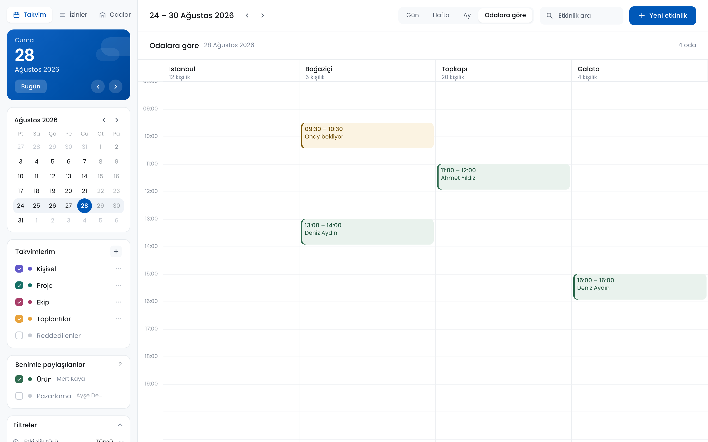 |
| Izgaraya tıkla, adını yaz, oluştur. | Odalar sütun olur; çakışmalar tek bakışta görünür. |

### Onay akışı ve paylaşım

| Rezervasyon talepleri | Takvim paylaşımı |
|---|---|
| 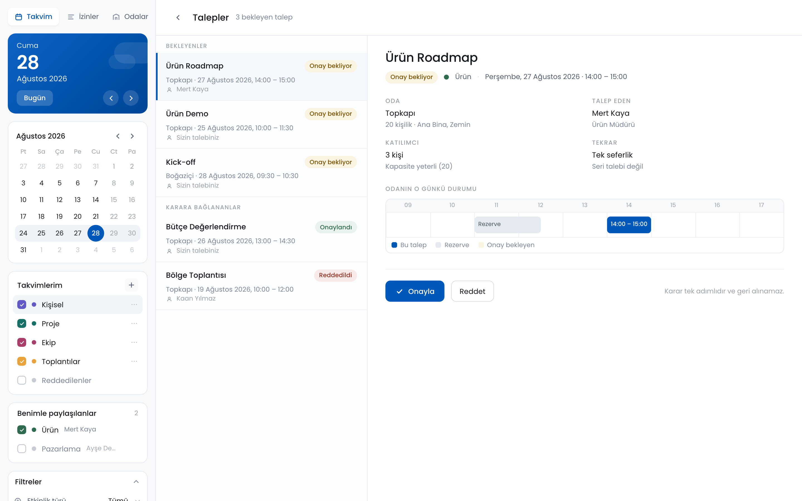 | 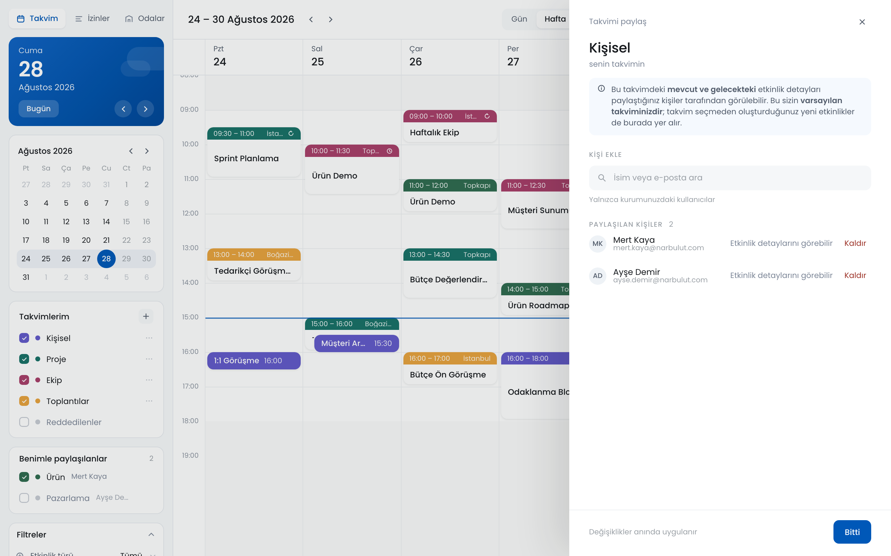 |
| Master–detail onay kutusu; oda müsaitlik çizelgesi kararla aynı ekranda. | Organizasyon içi tekil kullanıcıyla paylaşım; alıcı tarafında kaldırma. |

| Salt okunur paylaşılan etkinlik | Kendi talebini onaylayamama |
|---|---|
| 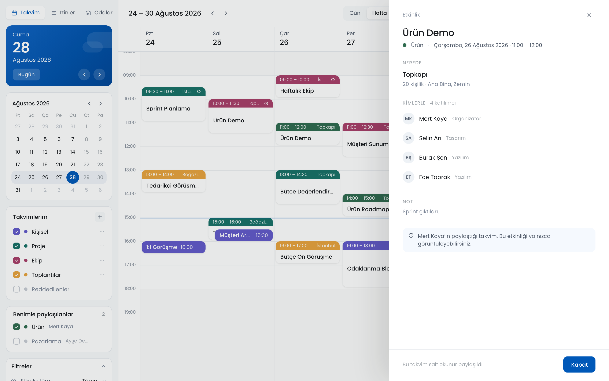 | 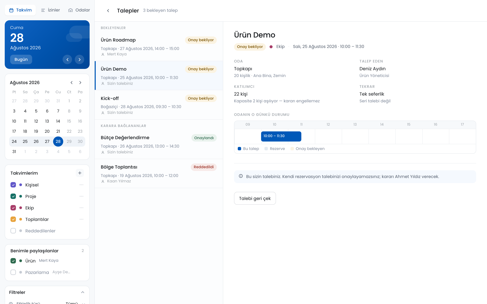 |
| Yetki yoksa arayüz düzenlenebilir görünmez — `BR-PRM-11`. | `BR-APR-17a`: kullanıcı kendi talebini onaylayamaz, "geri çek" sunulur. |

### Yönetim ve diğer görünümler

| Odalar yönetimi | İzinler |
|---|---|
| 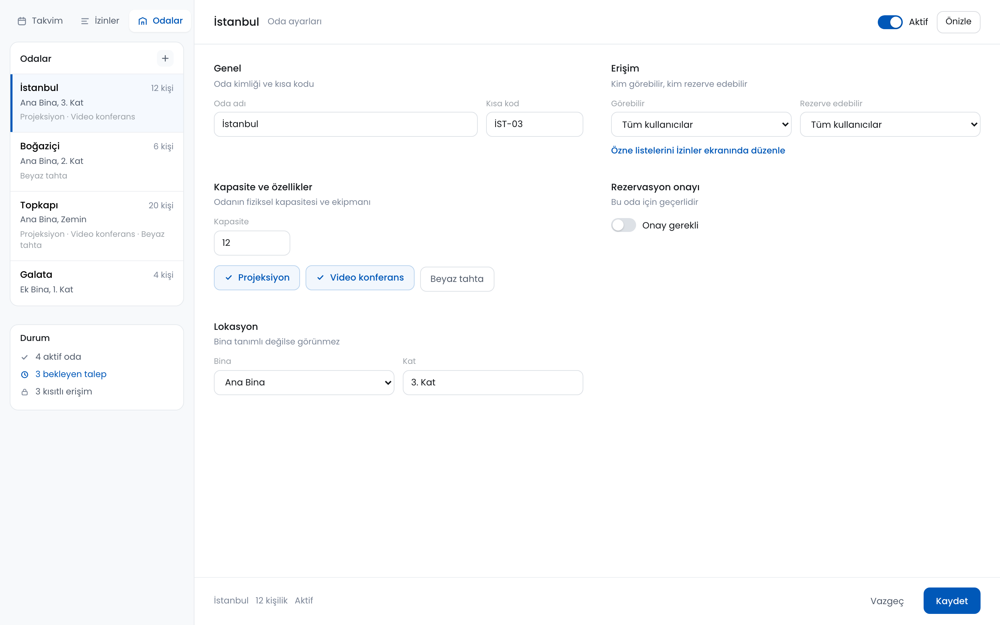 | 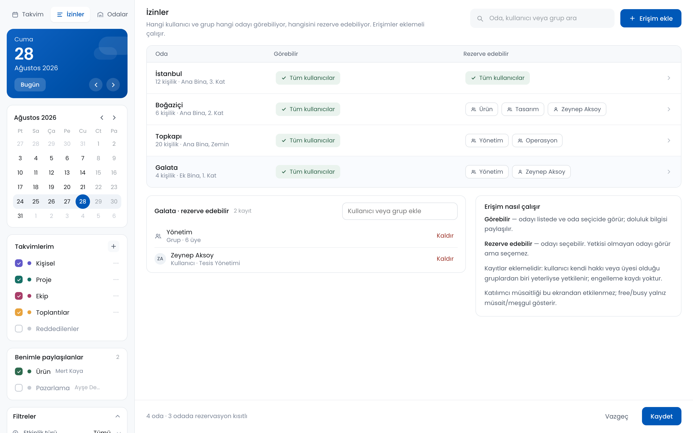 |

| Gün görünümü | Ay görünümü |
|---|---|
| 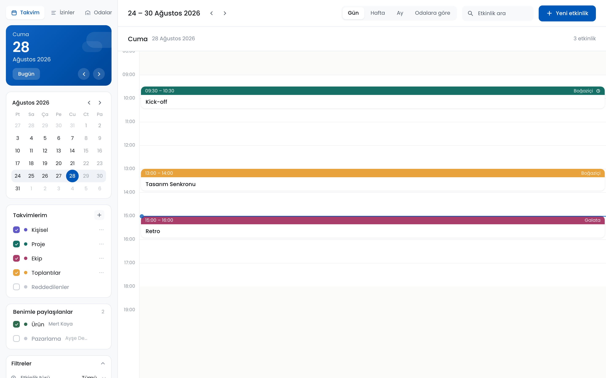 | 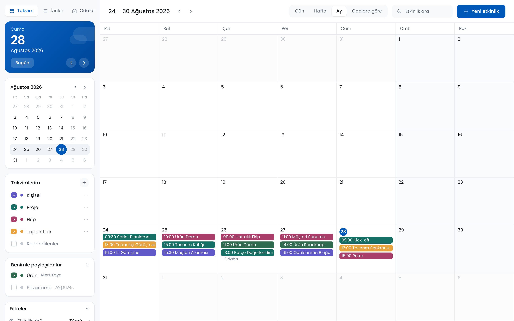 |

### Mobil (390 × 844)

<div align="center">
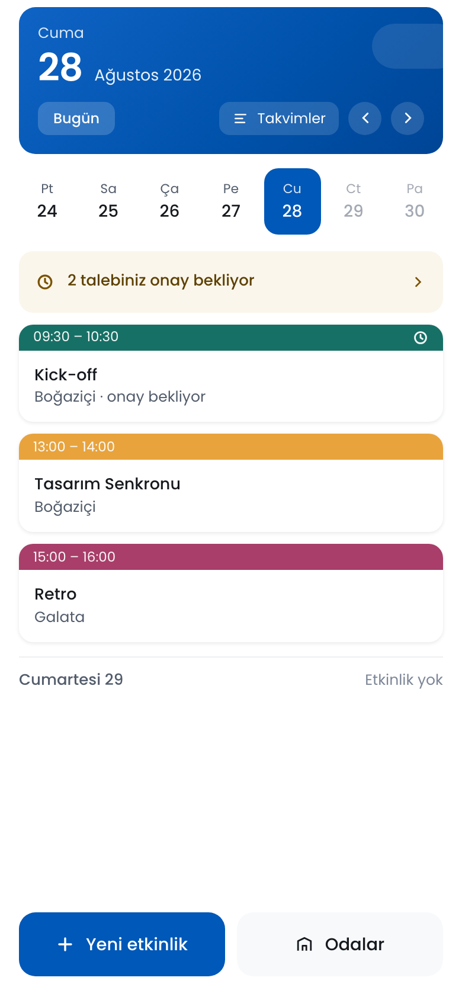
&nbsp;&nbsp;&nbsp;
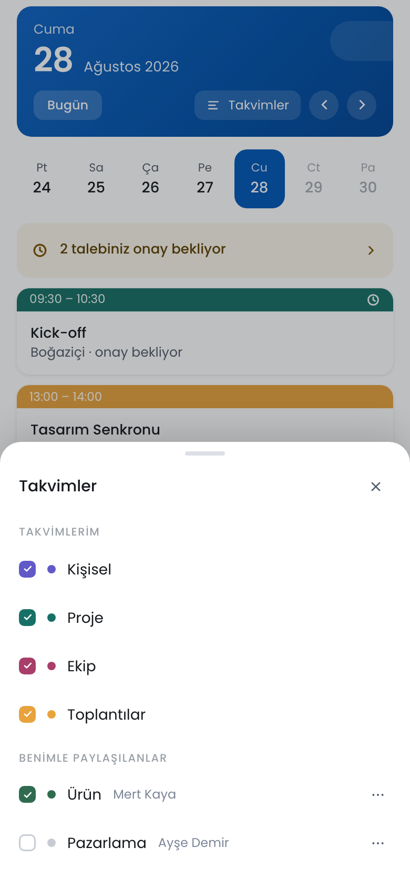
</div>

### Başlangıç noktası — mevcut ürün

Karşılaştırma için, yeniden tasarımın girdisi olan **mevcut Narbulut Takvim** (v2.13.8)
ekran görüntüleri `NarbulutTakvimSS/` altındadır. `docs/takvim/00-current-state-audit.md`
bulgularının `[O] OBSERVED` kanıt kaynağı bu görsellerdir.

| Mevcut ürün — ana görünüş | Mevcut ürün — etkinlik ekleme |
|---|---|
|  |  |

---

## Depo yapısı

```
.
├── prototype/            ⭐ Çalışan frontend prototipi (Vite + React 19 + TypeScript)
│   ├── src/
│   │   ├── components/   Ekranlar ve bileşenler (calendar, event, room, requests, admin, mobile)
│   │   ├── lib/domain/   Alan modeli, iş kuralları (rules.ts), seçiciler, zaman aritmetiği
│   │   ├── lib/state/    Reducer + demo verisi — tek gerçek kaynak
│   │   └── styles/       Tasarım token'ları, ekran CSS'leri, self-hosted Poppins
│   ├── emails/           16 e-posta şablonu + token'lar
│   ├── scripts/          demo-flow · screenshots · kalite kapıları (gates)
│   ├── docs/             Mimari, backend devri, demo rehberi, bilinen sınırlar
│   └── README.md         Prototipin kendi ayrıntılı dokümanı
│
├── docs/takvim/          📘 Ürün spec'leri ve karar kaydı (19 doküman)
├── docs/screenshots/     Prototipten üretilen ekran görüntüleri (bu README'nin kaynağı)
│
├── design/               🎨 Tasarım oturumu artefaktları
│   ├── docs/takvim/23-CURRENT-HANDOFF.md   Tasarım oturumunun devir dokümanı
│   ├── assets/narbulut-logo.png            Tek gerçek marka varlığı
│   └── SUPERSEDED-*.html                   Eski denemeler — geçersiz, yalnız arşiv
│
├── akm/                  Yerleşim haritası ve test notları
└── NarbulutTakvimSS/     📷 Mevcut ürünün ekran görüntüleri (audit kanıtı)
```

---

## Faz durumu

| Faz | Durum | Çıktı |
|---|---|---|
| 1 · Current State Audit | ✅ | `docs/takvim/00-current-state-audit.md` (rev.3 FINAL) |
| 2 · Competitor Benchmark | ✅ | `01-competitor-capability-map.md` |
| 3 · Problem kümeleri ve çözüm seçenekleri | ✅ | `02`, `03`, `03b` |
| 4 · Kapsam kapanışı | ✅ | `04-scope-closure.md` |
| 5 · Ürün spec'leri | ✅ | `10`–`19` (izinler, takvimler, odalar, kabuk, etkinlik, rezervasyon, planlama, onay, bildirim) |
| 6 · UX akışları ve tasarım dili | ✅ | `20-ux-flows.md`, `21-calendar-design-brief.md` |
| 7 · Frontend prototip | ✅ | `prototype/` |
| 8 · E-posta tasarım sistemi | ✅ | `prototype/emails/` — 16 şablon |
| 9 · Dokümantasyon | ✅ | `prototype/docs/` |
| 10 · Backend | ⬜ Başlamadı | Devir dokümanı hazır: `prototype/docs/BACKEND-HANDOFF.md` |

Otonom yürütmenin denetim izi ve kapatılan belirsizlikler (K-01…K-12):
[`prototype/AUTONOMOUS-STATUS.md`](prototype/AUTONOMOUS-STATUS.md)

---

## Dokümantasyon

### Ürün — `docs/takvim/`

| Doküman | İçerik |
|---|---|
| [`DECISIONS.md`](docs/takvim/DECISIONS.md) | **Karar kaydı — en yüksek öncelikli kaynak.** Çelişki halinde bu geçerlidir. |
| [`00-current-state-audit.md`](docs/takvim/00-current-state-audit.md) | Mevcut ürün denetimi; `[O]`/`[I]`/`[U]` kanıt seviyeleriyle |
| [`01-competitor-capability-map.md`](docs/takvim/01-competitor-capability-map.md) | Google/Outlook — yalnız kullanılabilirlik referansı |
| [`02-problem-clusters.md`](docs/takvim/02-problem-clusters.md) | 6 kanıtlanmış problem kümesi |
| [`03-solution-options.md`](docs/takvim/03-solution-options.md) · [`03b`](docs/takvim/03b-phase3-decision-summary.md) | Çözüm seçenekleri ve seçim gerekçesi |
| [`04-scope-closure.md`](docs/takvim/04-scope-closure.md) | Kapsam içi / kapsam dışı kesin ayrımı |
| [`10-permissions-spec.md`](docs/takvim/10-permissions-spec.md) | Yetki modeli — `BR-PRM-*` |
| [`11-system-states-spec.md`](docs/takvim/11-system-states-spec.md) | Boş / yükleniyor / hata / yetkisiz durumları — `ST-*` |
| [`12-calendars-spec.md`](docs/takvim/12-calendars-spec.md) | Takvimler ve paylaşım — `BR-CAL-*` |
| [`13-rooms-spec.md`](docs/takvim/13-rooms-spec.md) | Oda modeli — `BR-ROOM-*` |
| [`14-calendar-shell-spec.md`](docs/takvim/14-calendar-shell-spec.md) | Kabuk, gezinme, hover önizleme — `BR-SHELL-*` |
| [`15-event-spec.md`](docs/takvim/15-event-spec.md) | Etkinlik yaşam döngüsü — `BR-EVT-*` |
| [`16-room-booking-spec.md`](docs/takvim/16-room-booking-spec.md) | Oda rezervasyonu ve müsaitlik — `BR-BOOK-*` |
| [`17-scheduling-spec.md`](docs/takvim/17-scheduling-spec.md) | Planlama ve çakışma |
| [`18-reservation-approval-spec.md`](docs/takvim/18-reservation-approval-spec.md) | Onay akışı — `BR-APR-*` |
| [`19-notifications-spec.md`](docs/takvim/19-notifications-spec.md) | 16 domain event ve bildirim kodları — `N-*` |
| [`20-ux-flows.md`](docs/takvim/20-ux-flows.md) | Uçtan uca kullanıcı akışları |
| [`21-calendar-design-brief.md`](docs/takvim/21-calendar-design-brief.md) | Tasarım dili brief'i |

### Teknik — `prototype/docs/`

| Doküman | İçerik |
|---|---|
| [`FRONTEND-ARCHITECTURE.md`](prototype/docs/FRONTEND-ARCHITECTURE.md) | Durum yönetimi, klasör düzeni, veri akışı |
| [`BACKEND-HANDOFF.md`](prototype/docs/BACKEND-HANDOFF.md) | **Backend ekibi buradan başlasın** — beklenen uçlar ve sözleşmeler |
| [`DESIGN-IMPLEMENTATION-MAP.md`](prototype/docs/DESIGN-IMPLEMENTATION-MAP.md) | Hangi canonical ekran hangi bileşende karşılandı |
| [`EMAIL-DESIGN-SYSTEM.md`](prototype/docs/EMAIL-DESIGN-SYSTEM.md) | E-posta token'ları ve şablon sistemi |
| [`DEMO-GUIDE.md`](prototype/docs/DEMO-GUIDE.md) | Sunum senaryosu, adım adım |
| [`KNOWN-LIMITATIONS.md`](prototype/docs/KNOWN-LIMITATIONS.md) | **31 bilinçli sınır** — hiçbiri hata değildir |

---

## Ne var, ne yok

**Var**

- Hafta / gün / ay / "odalara göre" görünümleri, gerçek gezinme
- Etkinlik oluşturma, düzenleme, silme — durum gerçekten değişir
- Oda seçici: müsait / dolu / onay bekliyor / yetkisiz, gerçek kurallarla
- Rezervasyon onay akışı: talep → onay/red → takvimde sonuç
- Takvim paylaşımı: kişi ekleme/kaldırma, alıcı tarafında görünürlük ve kaldırma
- Etkinlik hover önizleme kartı (`BR-SHELL-41…45`) — bilgi hover'a hapsedilmeden
- Oda yönetimi ve izin yönetimi ekranları
- 390px mobil agenda görünümü ve sheet'ler
- 16 e-posta şablonu (statik önizleme)

**Yok** — bilinçli olarak

- Gerçek backend, veritabanı, kimlik doğrulama, kalıcılık
- Gerçek e-posta gönderimi (SMTP/API)
- Sunucu tarafı yetki uygulaması, eşzamanlılık
- ICS içe/dışa aktarma, harici takvim senkronizasyonu (Google/Outlook)
- Sürükle-bırak ile taşıma/yeniden boyutlandırma
- Yerelleştirme — arayüz yalnız Türkçe

Tam liste ve gerekçeleri: [`prototype/docs/KNOWN-LIMITATIONS.md`](prototype/docs/KNOWN-LIMITATIONS.md)

> ⚠️ **Güvenlik notu:** İstemcideki yetki kontrolleri bir güvenlik sınırı **değildir**.
> Backend geldiğinde tüm yetki kuralları sunucu tarafında yeniden uygulanmalıdır (`L-07`).

---

## Kalite kapıları

`prototype/scripts/gates.mjs` ile doğrulanır:

| Kapı | Ölçüt |
|---|---|
| **A** Build | `npm run build` hatasız |
| **B** TypeScript | `tsc -b` · 0 hata (strict, `noUnusedLocals`, `noUnusedParameters`) |
| **C** Konsol | Canonical demo akışı boyunca uncaught error / React warning / failed request = 0 |
| **D** Etkileşim | 24 adımlık demo akışı baştan sona tamamlanır |
| **E** Görsel | Canonical ekranlarla karşılaştırma |
| **F** Responsive | 1440×900 ve 390×844 doğrulanır; 375–1440px arası yatay taşma yok |
| **G** Offline | `npm install` sonrası harici istek = 0 |

Testler: **42 test / 2 dosya** — `npm test`.

---

## Tasarım dili

| | |
|---|---|
| **Tipografi** | Poppins 400 / 500 / 600 — self-hosted. Sayısal alanlarda `font-variant-numeric: tabular-nums` |
| **Marka rengi** | `#0058B8` — yalnız birincil aksiyon, aktif sekme, odak ve "bugün". Etkinlik kategori rengi **değildir** |
| **Kabuk** | Gerçek Narbulut paneli içinde yaşar; standalone SaaS uygulaması gibi görünmez |
| **Demo saati** | 28 Ağustos 2026 Cuma 15:00'e sabitlenmiştir — sunum her açılışta aynı ekranı gösterir |

Ayrıntı: [`docs/takvim/21-calendar-design-brief.md`](docs/takvim/21-calendar-design-brief.md)

---

## Lisans

© Narbulut. Tüm hakları saklıdır. Bu depo Narbulut'un iç ürün çalışmasıdır ve
açık kaynak lisansı altında dağıtılmamaktadır.

**Üçüncü taraf:** Poppins fontu (`prototype/src/styles/fonts/`) Indian Type Foundry
tarafından SIL Open Font License 1.1 altında yayımlanmıştır.
